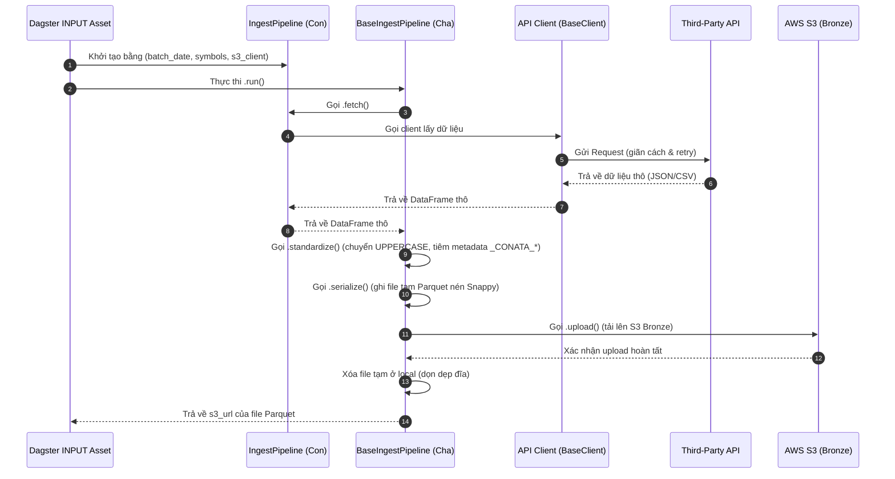

# Ingestion Layer Design Specification

## 1. Overview
Ingestion Layer (Tầng thu thập dữ liệu) là bước khởi đầu của toàn bộ Data Pipeline. Nhiệm vụ cốt lõi là thu thập dữ liệu thô từ các nguồn khác nhau (APIs chứng khoán, cổng thông tin vĩ mô, tin tức doanh nghiệp...), chuẩn hóa tên cột và tiêm trường metadata hệ thống (`_CONATA_*`), lưu trữ tạm thời dưới dạng file Parquet nén Snappy, và tải lên AWS S3 (Bronze Layer/Raw).

Tài liệu này đặc tả chi tiết kiến trúc hướng đối tượng cho Ingestion Layer, cách tổ chức 17 file logic pipeline độc lập tương ứng với 17 bảng dữ liệu thô, cơ chế an toàn (Retry & Rate Limiting), cách tích hợp vào Dagster và kế hoạch kiểm thử.

---

## 2. Directory Structure
Để đảm bảo tách biệt trách nhiệm rõ ràng, logic Ingestion (Crawl/API -> S3) sẽ nằm hoàn toàn dưới thư mục `src/ingest/`. Thư mục `src/load/` cũ sẽ chỉ đảm nhiệm việc tải dữ liệu từ S3 vào Redshift.

```text
src/ingest/
├── __init__.py
├── client/
│   ├── __init__.py
│   ├── base_client.py          # BaseClient with retry & rate limiting
│   ├── vnstock_client.py       # vnstock v4 — stock price & company news
│   ├── world_bank_client.py    # World Bank API — macro indicators (GDP, CPI, etc.)
│   ├── yahoo_finance_client.py # Yahoo Finance — FX rates, interest rates, commodities
│   └── fireant_client.py       # FireAnt REST API — analyst reports (auth required)
│
└── pipeline/
    ├── __init__.py
    ├── base.py                 # Lớp BaseIngestPipeline (Abstract Base Class)
    │
    # --- MARKET DATA (Tần suất chạy: Hàng ngày - Daily) ---
    ├── stock_price_eod.py      # Thu thập giá đóng cửa cổ phiếu (RAW_STOCK_PRICE_EOD)
    ├── index_price_eod.py      # Thu thập giá chỉ số thị trường (RAW_INDEX_PRICE_EOD)
    ├── foreign_trading.py      # Thu thập giao dịch khối ngoại (RAW_FOREIGN_TRADING)
    ├── proprietary_trading.py  # Thu thập giao dịch tự doanh (RAW_PROPRIETARY_TRADING)
    │
    # --- COMPANY FUNDAMENTALS (Tần suất chạy: Hàng quý/Hàng tháng) ---
    ├── balance_sheet.py        # Thu thập Bảng cân đối kế toán (RAW_BALANCE_SHEET)
    ├── income_statement.py     # Thu thập Báo cáo kết quả KD (RAW_INCOME_STATEMENT)
    ├── cashflow_statement.py   # Thu thập Báo cáo lưu chuyển tiền tệ (RAW_CASHFLOW_STATEMENT)
    ├── financial_ratios.py     # Thu thập Các chỉ số tài chính (RAW_FINANCIAL_RATIOS)
    ├── company_profile.py      # Thu thập Thông tin hồ sơ DN (RAW_COMPANY_PROFILE)
    │
    # --- MACRO & COMMODITIES (Tần suất chạy: Linh hoạt theo ngày/tháng) ---
    ├── macro_indicators.py     # Thu thập các chỉ số vĩ mô GDP, CPI (RAW_MACRO_INDICATORS)
    ├── interest_rates.py       # Thu thập dữ liệu lãi suất (RAW_INTEREST_RATES)
    ├── exchange_rates.py       # Thu thập dữ liệu tỷ giá (RAW_EXCHANGE_RATES)
    ├── commodities_price.py    # Thu thập dữ liệu giá hàng hóa/dầu (RAW_COMMODITIES_PRICE)
    │
    # --- QUALITATIVE DATA (Tần suất chạy: Hàng ngày/Real-time) ---
    ├── news_articles.py        # Thu thập tin tức doanh nghiệp (RAW_NEWS_ARTICLES)
    ├── corporate_events.py     # Thu thập lịch sự kiện doanh nghiệp (RAW_CORPORATE_EVENTS)
    ├── insider_transactions.py # Thu thập giao dịch cổ đông nội bộ (RAW_INSIDER_TRANSACTIONS)
    └── analyst_reports.py      # Thu thập báo cáo phân tích doanh nghiệp (RAW_ANALYST_REPORTS)
```

---

## 3. Shared Components Design

### A. Base Client (`src/ingest/client/base_client.py`)
Mọi Client kết nối nguồn dữ liệu bên ngoài phải kế thừa từ `BaseClient` để thừa hưởng các cơ chế an toàn:
*   **Rate Limiting**: Giãn cách có cấu hình giữa các request thông qua `request_delay_seconds`.
*   **Exponential Backoff Retry**: Sử dụng thư viện `tenacity` để tự động thử lại tối đa 3 lần khi gặp lỗi kết nối hoặc lỗi dịch vụ từ phía API nguồn.

```python
import logging
import time
from collections.abc import Callable
from typing import ParamSpec, TypeVar

from tenacity import retry, stop_after_attempt, wait_exponential

logger = logging.getLogger(__name__)

P = ParamSpec("P")
R = TypeVar("R")


class BaseClient:
    def __init__(self, request_delay_seconds: float = 1.0) -> None:
        self.request_delay_seconds = request_delay_seconds
        self._last_request_time = 0.0

    def _apply_rate_limit(self) -> None:
        elapsed = time.time() - self._last_request_time
        if elapsed < self.request_delay_seconds:
            sleep_time = self.request_delay_seconds - elapsed
            logger.debug("Rate limiting: waiting %.2f seconds", sleep_time)
            time.sleep(sleep_time)
        self._last_request_time = time.time()

    @retry(
        stop=stop_after_attempt(3),
        wait=wait_exponential(multiplier=1, min=2, max=10),
        reraise=True,
    )
    def call_api_with_retry(
        self,
        func: Callable[P, R],
        *args: P.args,
        **kwargs: P.kwargs,
    ) -> R:
        self._apply_rate_limit()
        try:
            return func(*args, **kwargs)
        except Exception as e:
            logger.warning("API call failed: %s. Retrying...", e)
            raise e
```

### B. Base Ingest Pipeline (`src/ingest/pipeline/base.py`)
Lớp trừu tượng định nghĩa khung sườn (Template Method) cho vòng đời Ingestion. Các tham số như `batch_date` và `symbols` được truyền tĩnh qua constructor khi Dagster khởi tạo.

```python
import abc
import datetime
import logging
import os
import tempfile
import time
from typing import TYPE_CHECKING

import pandas as pd

from src.common.s3_util import upload_to_s3

if TYPE_CHECKING:
    from mypy_boto3_s3.client import S3Client


# Fallback list of VN30 symbols to ensure basic data ingestion runs
# when no symbols are explicitly provided at runtime.
DEFAULT_TICKER_SYMBOLS: list[str] = [
    "ACB", "BCM", "BID", "BVH", "CTG",
    "FPT", "GAS", "GVR", "HDB", "HPG",
    "MBB", "MSN", "MWG", "PLX", "PNJ",
    "POW", "SAB", "SHB", "SSB", "SSI",
    "STB", "TCB", "TPB", "VCB", "VHM",
    "VIC", "VJC", "VNM", "VPB", "VRE",
]


class BaseIngestPipeline(abc.ABC):
    def __init__(
        self,
        batch_date: str,
        symbols: list[str] | None = None,
        s3_client: "S3Client | None" = None,
        bucket_name: str = "finops-raw-dev",
    ) -> None:
        self.batch_date = batch_date
        self.symbols = symbols or []
        self.s3_client = s3_client
        self.bucket_name = bucket_name
        self.logger = logging.getLogger(self.__class__.__name__)

    @property
    @abc.abstractmethod
    def table_name(self) -> str:
        """Destination raw Redshift table name (e.g. RAW_STOCK_PRICE_EOD)."""
        pass

    @property
    @abc.abstractmethod
    def source_uri_prefix(self) -> str:
        """Source URI pointer representing data origin (e.g. api://vnstock/price)."""
        pass

    @property
    @abc.abstractmethod
    def schema_columns(self) -> list[str]:
        """Ordered list of business columns to retain (lowercase, snake_case).

        Columns defined here will be selected and reordered after uppercase
        conversion. Extra columns from the API are dropped; missing columns
        are filled with None and logged as warnings.
        """
        pass

    @abc.abstractmethod
    def fetch(self) -> pd.DataFrame:
        """Fetch raw records from the API client or crawler."""
        pass

    def standardize(self, df: pd.DataFrame) -> pd.DataFrame:
        """Standardize column names, filter to schema, and inject metadata.

        Column selection order:
        1. Uppercase all column names from source.
        2. Retain only columns declared in schema_columns (uppercased).
        3. Fill any missing declared columns with None and warn.
        4. Inject _CONATA_* metadata columns at the end.
        """
        result_df = df.copy()
        result_df.columns = result_df.columns.str.upper()

        expected_cols = [col.upper() for col in self.schema_columns]
        available_cols = set(result_df.columns)

        missing = [col for col in expected_cols if col not in available_cols]
        if missing:
            self.logger.warning(
                "Schema columns missing from API response for %s: %s. Filling with None.",
                self.table_name,
                missing,
            )
            for col in missing:
                result_df[col] = None

        result_df = result_df[expected_cols]

        result_df["BATCH_DATE"] = self.batch_date
        result_df["_CONATA_SOURCE"] = self.source_uri_prefix
        result_df["_CONATA_SOURCE_ROW_NUMBER"] = range(1, len(result_df) + 1)
        result_df["_CONATA_PARTITION_KEY"] = self.batch_date
        result_df["_CONATA_LOADED_AT"] = pd.Timestamp.now(tz=datetime.UTC)

        return result_df

    def serialize(self, df: pd.DataFrame) -> str:
        with tempfile.NamedTemporaryFile(suffix=".parquet", delete=False) as temp_file:
            temp_path = temp_file.name
        df.to_parquet(temp_path, compression="snappy", index=False)
        return temp_path

    def upload(self, temp_file_path: str) -> str:
        unix_timestamp = int(time.time())
        s3_key = (
            f"raw/{self.table_name}/"
            f"batch_date={self.batch_date}/"
            f"{unix_timestamp}/{self.table_name}.parquet"
        )
        s3_url = f"s3://{self.bucket_name}/{s3_key}"
        upload_to_s3(
            file_path=temp_file_path,
            output_s3_url=s3_url,
            s3_client=self.s3_client,
            logger=self.logger,
        )
        return s3_url

    def run(self) -> str:
        """Coordinate e2e ingestion lifecycle: fetch, standardize, serialize, upload."""
        temp_path: str | None = None
        try:
            df = self.fetch()
            if df.empty:
                self.logger.warning("Empty records fetched. Skipping subsequent steps.")
                return ""
            df = self.standardize(df)
            temp_path = self.serialize(df)
            return self.upload(temp_path)
        finally:
            if temp_path and os.path.exists(temp_path):
                os.unlink(temp_path)
```

> **Note — `ProprietaryTradingPipeline`:** `fetch()` raises `NotImplementedError`. vnstock v4 does not expose proprietary trading data for any supported source (VCI, KBS). The pipeline skeleton exists in `src/ingest/pipeline/proprietary_trading.py` but requires a paid data source (FiinTrade or Vietstock) to implement.

---

## 4. Data Flow Lifecycle & Diagrams

### Sequence Diagram


---

## 5. Dagster Integration & Downstream Trigger
Mỗi file pipeline con trong `pipeline/` sẽ được gọi bởi một Dagster Asset tương ứng. 

1.  **INPUT Asset**: Dagster Asset thuộc nhóm `INPUT` khởi tạo class pipeline tương ứng bằng cách truyền tham số cấu hình (tĩnh) qua constructor, gọi phương thức `.run()` và nhận về `s3_url` để đưa vào metadata của Asset Output.
2.  **Redshift Load Sensor (`load_job_sensor`)**: Cảm biến này theo dõi các asset nhóm `INPUT` được materialized, trích xuất `s3_url` và `batch_date` từ metadata, sau đó kích hoạt Job nạp dữ liệu tương ứng trong `src/dagster/load_job.py` để thực thi lệnh `COPY` vào Redshift Bronze tables.

---

## 6. Error Handling & Security
*   **Không Catch-and-Ignore Exception**: Mọi ngoại lệ trong quá trình lấy dữ liệu, ghi file, và tải lên S3 đều phải để văng tự do (fail loudly) để hệ thống điều phối (Dagster) ghi nhận lỗi và gửi thông báo cảnh báo kịp thời.
*   **Bảo mật Thông tin nhạy cảm**: Tuyệt đối không lưu cứng (hardcode) các API keys, AWS credentials trong code. Các API clients phải truy xuất các giá trị này qua biến môi trường hoặc AWS Secrets Manager đã được Dagster resource bọc sẵn.

---

## 7. Testing & Verification Plan

### Unit Tests

**Client tests** (`tests/ingest/client/`):
*   `test_base_client.py`: Verifies retry fires up to 3 times on failure and rate limiting enforces minimum spacing between calls.
*   `test_vnstock_client.py`: Mocks `Vnstock()` to verify price and news fetch calls.
*   `test_world_bank_client.py`: Mocks `httpx.get` to verify indicator fetching and empty-response handling.
*   `test_yahoo_finance_client.py`: Mocks `yfinance` to verify single-ticker history fetching.
*   `test_fireant_client.py`: Mocks `requests` to verify login auth flow and paginated report fetching.

**Pipeline tests** (`tests/ingest/`):
*   `test_base_pipeline.py`: Uses a concrete test subclass of `BaseIngestPipeline` to verify: column uppercasing, `schema_columns` filtering, missing-column fill-with-None, `_CONATA_*` metadata injection, and S3 upload path format (boto3 mocked via `moto`).
*   Per-pipeline files (`test_stock_price_eod_pipeline.py`, `test_balance_sheet_pipeline.py`, etc.): Each verifies the `fetch()` implementation for that pipeline using mocked clients.

### Lệnh thực thi
*   **Chạy Unit Tests**:
    ```bash
    uv run pytest tests/ingest/
    ```
*   **Linter & Code Format**:
    ```bash
    uv run ruff check src/ingest/
    uv run ruff format src/ingest/
    ```
